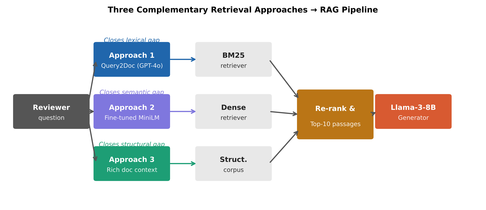
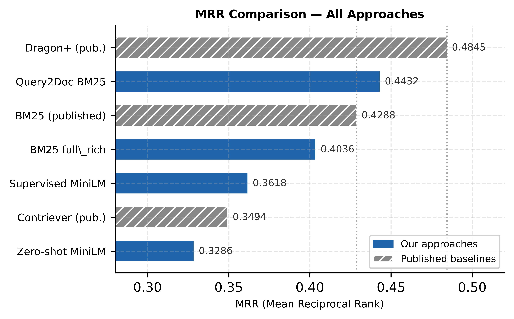

# Scientific Evidence Retrieval

Given a peer-review question and a full scientific paper (~12k tokens), retrieve the paragraph that contains the answer.

This is a **document-level information retrieval / RAG** project on [PeerQA](https://aclanthology.org/2025.naacl-long.22/) (NAACL 2025 Outstanding Paper). Reviewers write informal questions; papers use technical language. The system ranks candidate paragraphs **inside the source paper** (not web search).

**Result:** Query2Doc + BM25 reaches **MRR 0.4432** on 383 evidence-mapped questions, beating the published PeerQA BM25 baseline of **0.4288** and lifting Recall@1 from **0.193 → 0.250** (+30% relative) vs. an original-query BM25 baseline.

**Live demo:** [nlp-evidence-retrieval.streamlit.app](https://nlp-evidence-retrieval.streamlit.app/) — BM25 vs Query2Doc ranking on example papers.



## Results

Paragraph retrieval, 383 questions with mapped evidence.

| Method | MRR | Recall@1 | Recall@10 |
|---|---:|---:|---:|
| BM25 (original query) | 0.3852 | 0.1929 | 0.6072 |
| **BM25 + Query2Doc (gpt-4o)** | **0.4432** | **0.2500** | **0.6527** |
| BM25 + RRF (original ⊕ Query2Doc) | 0.4174 | 0.2278 | 0.6323 |
| PeerQA paper — BM25 | 0.4288 | — | 0.6817 |
| PeerQA paper — Dragon+ (best published dense) | 0.4845 | — | 0.6817 |

**Takeaways**

- Query2Doc closes the reviewer–paper lexical gap by generating an answer-like passage instead of paraphrasing the question.
- The largest gain is at **top-1**, which is what a typical RAG generator actually sees.
- Rank fusion **hurt** here: RRF averaged a strong Query2Doc ranking with a weaker original ranking (0.443 → 0.417). When one retriever dominates, do not fuse.
- Dragon+ is still higher on MRR. Query2Doc improves a cheap lexical retriever; it is not a claim of SOTA dense retrieval.



## How it works

**Query2Doc + BM25** (`approach1_query2doc.py`) is the main method.

1. An LLM writes a short hypothetical paper passage that would answer the reviewer question (not a rewrite of the question).
2. The BM25 query is `(question + " ") × 5 + pseudo-document`. The 5× repeat keeps original terms from being drowned out (Wang et al., EMNLP 2023).
3. Tokenization is Lucene-style: lowercase, English stopwords, Porter stemmer (`bm25s`).
4. Ranking is per paper, ~137 paragraphs on average.

The repo also includes:

- **Dense retrieval** — zero-shot and contrastive fine-tuning of `all-MiniLM-L6-v2` (`approach2_dense_retriever.py`)
- **Structural context** — title / section / position / abstract-snippet templates for BM25 (`approach3_structural_context.py`)

Failure mode worth knowing: Query2Doc can hallucinate specifics (e.g. a fake corpus size). That is acceptable for *term expansion*. It is not a final answer.

## Stack

Python · BM25 (`bm25s`, `rank-bm25`) · Query2Doc · OpenAI API · Sentence-Transformers / MiniLM · contrastive loss · MRR & Recall@k

## Full experiments

Requires Hugging Face PeerQA. Pin `datasets==2.19.0` (newer versions can fail to load this dataset). A fresh Query2Doc run needs `OPENAI_API_KEY`.

```bash
pip install -r requirements.txt
python prepare_data.py
python approach1_query2doc.py                 # --skip-rewrite if passages are cached
python baseline_bm25.py --level paragraph
python approach3_structural_context.py --level both
python approach2_dense_retriever.py --level paragraph --zero_shot_only
python compare_results.py
```

Saved metrics: `results/`. Longer notes: `docs/reports/`. The table above is the 383-question Query2Doc evaluation; some Hugging Face scripts may run on a smaller license slice.

## Layout

```
demo/                         Streamlit ranking UI (source for the hosted app)
approach1_query2doc.py        Query2Doc + BM25
approach2_dense_retriever.py  MiniLM dense retrieval
approach3_structural_context.py
baseline_bm25.py
prepare_data.py               PeerQA → JSONL
results/                      Reported metrics
docs/                         Report, poster, figures
```

## Writeup

- [Live demo](https://nlp-evidence-retrieval.streamlit.app/)
- [Technical report](docs/final-report.pdf)
- [Poster](docs/poster.pdf)
- [Query2Doc method notes](docs/reports/approach1_query2doc.md)

## License

Code is MIT (`LICENSE`). PeerQA data is [CC-BY-NC-SA 4.0](https://creativecommons.org/licenses/by-nc-sa/4.0/) and is **not** bundled here.

```bibtex
@inproceedings{baumgartner-etal-2025-peerqa,
  title = "{P}eer{QA}: A Scientific Question Answering Dataset from Peer Reviews",
  author = {Baumg{\"a}rtner, Tim and Briscoe, Ted and Gurevych, Iryna},
  booktitle = "NAACL 2025",
  year = "2025"
}
```
